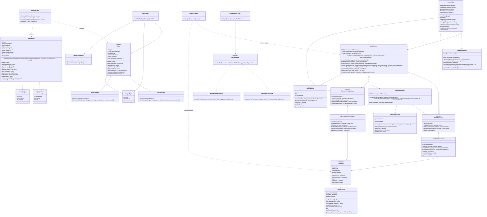

```mermaid
classDiagram
    %% === ENUMS ===
    class CryptoType {
        <<enumeration>>
        BITCOIN
        ETHEREUM
    }
    
    class FeePriority {
        <<enumeration>>
        ECONOMIQUE
        STANDARD
        RAPIDE
    }
    
    class TransactionStatus {
        <<enumeration>>
        PENDING
        CONFIRMED
        REJECTED
    }

    %% === MODEL LAYER ===
    class Wallet {
        <<abstract>>
        -String id
        -CryptoType cryptoType
        -String address
        -BigDecimal balance
        -Instant createdAt
        -List~Transaction~ transactions
        +getId() String
        +getCryptoType() CryptoType
        +getAddress() String
        +getBalance() BigDecimal
        +getCreatedAt() Instant
        +getTransactions() List~Transaction~
        +setBalance(BigDecimal balance)
        +addTransaction(Transaction tx)
    }
    
    class BitcoinWallet {
        +BitcoinWallet(String address)
        +BitcoinWallet(String id, String address, BigDecimal balance, Instant createdAt)
    }
    
    class EthereumWallet {
        +EthereumWallet(String address)
        +EthereumWallet(String id, String address, BigDecimal balance, Instant createdAt)
    }
    
    class Transaction {
        -String id
        -String fromAddress
        -String toAddress
        -BigDecimal amount
        -FeePriority feePriority
        -Instant createdAt
        -BigDecimal feeAmount
        -TransactionStatus status
        -String walletId
        +Transaction(String fromAddress, String toAddress, BigDecimal amount, FeePriority feePriority, String walletId)
        +getId() String
        +getFromAddress() String
        +getToAddress() String
        +getAmount() BigDecimal
        +getFeePriority() FeePriority
        +getCreatedAt() Instant
        +getFeeAmount() BigDecimal
        +getStatus() TransactionStatus
        +getWalletId() String
        +setFeeAmount(BigDecimal feeAmount)
        +setStatus(TransactionStatus status)
    }

    %% === SERVICE LAYER ===
    class WalletService {
        -WalletRepository walletRepository
        -TransactionRepository transactionRepository
        -TransactionService transactionService
        +WalletService(WalletRepository walletRepository, TransactionRepository transactionRepository)
        +createWallet(String typeInput) ServiceResult~Wallet~
        +findWallet(String walletId) ServiceResult~Wallet~
        +addFunds(String walletId, String amountStr) ServiceResult~Wallet~
        +createTransaction(String walletId, String toAddress, String amountStr, String priorityInput) ServiceResult~Transaction~
        +compareFees(String walletId, String toAddress, String amountStr) ServiceResult~List~FeeComparison~~
        -parseWalletType(String typeInput) CryptoType
        -parsePriority(String priorityInput) FeePriority
        -isValidAddress(CryptoType cryptoType, String address) boolean
    }
    
    class ServiceResult {
        <<generic>>
        -boolean success
        -T data
        -String message
        +success(T data, String message) ServiceResult~T~
        +failure(String message) ServiceResult~T~
        +isSuccess() boolean
        +getData() T
        +getMessage() String
    }
    
    class TransactionService {
        -WalletRepository walletRepository
        +TransactionService(WalletRepository walletRepository)
        +createTransaction(Wallet wallet, String toAddress, BigDecimal amount, FeePriority priority) TransactionResult
        +addFunds(Wallet wallet, BigDecimal amount)
    }
    
    class TransactionResult {
        -boolean success
        -Transaction transaction
        -String message
        +success(Transaction transaction, String message) TransactionResult
        +failure(String message) TransactionResult
        +isSuccess() boolean
        +getTransaction() Transaction
        +getMessage() String
    }
    
    class FeeCalculator {
        <<interface>>
        +calculateFee(Transaction tx, Wallet wallet, FeePriority priority) BigDecimal
    }
    
    class BitcoinFeeCalculator {
        +calculateFee(Transaction tx, Wallet wallet, FeePriority priority) BigDecimal
    }
    
    class EthereumFeeCalculator {
        +calculateFee(Transaction tx, Wallet wallet, FeePriority priority) BigDecimal
    }
    
    class FeeCalculatorFactory {
        +forType(CryptoType type) FeeCalculator
    }
    
    class WalletFactory {
        +createWallet(CryptoType type) Wallet
    }
    
    class MempoolService {
        -List~Transaction~ pending
        +addTransaction(Transaction tx)
        +getPendingSortedByFeeDesc() List~Transaction~
        +computePosition(Transaction myTx) int
        +getDebugInfo() DebugInfo
        +computeHypotheticalPosition(BigDecimal hypotheticalFee) int
        +estimateConfirmationTime(Transaction myTx) Duration
        +generateRandomPending(int count)
    }

    %% === REPOSITORY LAYER ===
    class WalletRepository {
        <<interface>>
        +save(Wallet wallet)
        +findById(String id) Optional~Wallet~
        +findByAddress(String address) Optional~Wallet~
        +updateBalance(String id, BigDecimal newBalance)
        +findAll() List~Wallet~
    }
    
    class TransactionRepository {
        <<interface>>
        +save(Transaction tx)
        +findById(String id) Optional~Transaction~
        +findPending() List~Transaction~
        +findByWalletId(String walletId) List~Transaction~
        +updateStatus(String id, TransactionStatus status)
    }
    
    class JdbcWalletRepository {
        +save(Wallet wallet)
        +findById(String id) Optional~Wallet~
        +findByAddress(String address) Optional~Wallet~
        +updateBalance(String id, BigDecimal newBalance)
        +findAll() List~Wallet~
        -insertWallet(Wallet wallet)
        -updateWallet(Wallet wallet)
    }
    
    class JdbcTransactionRepository {
        +save(Transaction tx)
        +findById(String id) Optional~Transaction~
        +findPending() List~Transaction~
        +findByWalletId(String walletId) List~Transaction~
        +updateStatus(String id, TransactionStatus status)
        -mapRow(ResultSet rs) Transaction
    }

    %% === CONFIG LAYER ===
    class Database {
        <<singleton>>
        -String url
        -String user
        -String password
        -boolean initialized
        +getInstance() Database
        +getConnection() Connection
        +init()
        +isHealthy() boolean
        -loadDatabaseDriver()
    }
    
    class ConfigManager {
        -String CONFIG_FILE
        -Properties properties
        -boolean initialized
        +getDatabaseUrl() String
        +getDatabaseUser() String
        +getDatabasePassword() String
        +getMaxConnections() int
        +getConnectionTimeout() long
        -init()
        -loadDefaultProperties()
        -getProperty(String key, String defaultValue) String
    }

    %% === UTILS ===
    class AddressGenerator {
        +generateEthereumAddress() String
        +generateBitcoinAddress() String
    }
    
    class ValidationUtils {
        +isPositive(BigDecimal value) boolean
        +isValidEthereumAddress(String address) boolean
        +isValidBitcoinAddress(String address) boolean
        +ofNullable(T value) Optional~T~
    }
    
    class LoggerProvider {
        +getLogger(String name) Logger
    }

    %% === UI LAYER ===
    class ConsoleApp {
        -WalletRepository walletRepo
        -TransactionRepository txRepo
        -MempoolService mempool
        -WalletService walletService
        -Transaction lastCreatedTx
        +main(String[] args)
        -printMenu()
        -createWallet(Scanner scanner)
        -addFunds(Scanner scanner)
        -checkBalance(Scanner scanner)
        -createTransaction(Scanner scanner)
        -showMyPosition()
        -compareFees(Scanner scanner)
        -showMempool()
    }

    %% === RELATIONSHIPS ===
    %% Inheritance
    Wallet <|-- BitcoinWallet
    Wallet <|-- EthereumWallet
    
    %% Interfaces
    FeeCalculator <|.. BitcoinFeeCalculator
    FeeCalculator <|.. EthereumFeeCalculator
    WalletRepository <|.. JdbcWalletRepository
    TransactionRepository <|.. JdbcTransactionRepository
    
    %% Composition/Aggregation
    Wallet --> CryptoType
    Transaction --> FeePriority
    Transaction --> TransactionStatus
    
    WalletService --> WalletRepository
    WalletService --> TransactionRepository
    WalletService --> TransactionService
    WalletService --> ServiceResult
    
    TransactionService --> WalletRepository
    TransactionService --> TransactionResult
    
    ConsoleApp --> WalletService
    ConsoleApp --> MempoolService
    ConsoleApp --> WalletRepository
    ConsoleApp --> TransactionRepository
    
    JdbcWalletRepository --> Database
    JdbcTransactionRepository --> Database
    Database --> ConfigManager
    
    %% Factory relationships
    WalletFactory --> Wallet
    WalletFactory --> CryptoType
    WalletFactory --> AddressGenerator
    FeeCalculatorFactory --> FeeCalculator
    
    %% Utility relationships
    ValidationUtils ..> Wallet : validates
    ValidationUtils ..> Transaction : validates
    LoggerProvider ..> WalletService : provides logging
    LoggerProvider ..> Database : provides logging
```